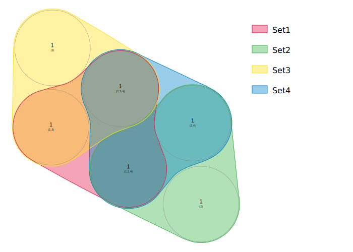
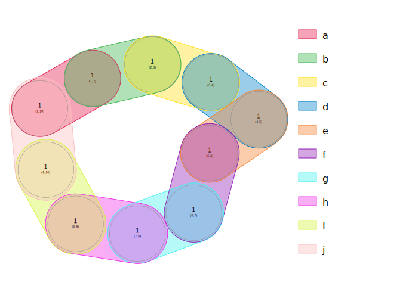

# nVennPy
This package adds a Python interface to the `nVenn2` algorithm to create generalized, quasi-proportional Venn diagrams. The release version is available from Pypi by running `pip install nvenn2` from an environment.

## The problem
We have several `sets` composed of `elements`, like gene symbols. Each element can belong to one or more sets, which places it into a `region`. A region is defined by the sets it belongs to and the sets it does not belong to. 

A proportional Venn diagrams shows sets inside closed lines that may intersect and define regions. The area of each region is approximately proportional to the number of elements that belong to that region. The nVenn2 algorithm is also generalized, as it can be used on any number of sets. In practice, a Venn diagram with more that six sets is difficult to interpret. However, more sets can be used if most regions are empty (see example 2).

## Input
The input for `nVenn2` is always a text table. The algorithm will try to guess the column separator (tab, space, comma or semicolon). Sets can be defined by row or column.  If sets are in rows, the first column contains the set names. If sets are in columns, the first row contains the set names. The table is passed to the `diagram()` method to create a new object. The second parameter tells the module whether the sets are in columns (`1`) or rows (`2`). A value of `0` (default) tells the module to try to figure out if the sets are in rows or columns.

## Simulation
After a Venn table has been loaded, the diagram is generated by calling the `simulate()` method on the object. Every time the method is invoked, the starting conditions change, and the result may be different. If one wants to keep a diagram, it is important to save the figure before running `simulate()` again.

## Output
The main output of `nVenn2` is an svg figure with the diagram. The svg code is obtained by calling the `to_svg()` method on the object. It can also be written into a file with the `write_svg` method. Multiple features in the figure can be customized by calling the `rotate_diagram`, `palette`, `set_color`, `set_opacity`, `set_line_width`, `show_region_number`, `show_region_identifier` and `set_font_size` methods. In addition, the diagram can be saved in the context of a web page that allows the user to explore the diagram with the `to_html()` method. The web page can be written with the `write_html` method.
Once the input is entered, users can also get the elements in a region with the `get_venn_region` method.

# Example 1

    import nvenn2
    n = nvenn2.diagram("Set1 TP53 SF3B1 POT1\nSet2 TP53 KRAS NRAS\nSet3 SF3B1 POT1 LMNA\nSet4 TP53 KRAS SF3B1", 2)
    n.simulate()
    print(n.tosvg())

    n.get_venn_region(["Set1", "Set3"])
    ["POT1"]
    
# Example 2
    import nvenn2
    v = nvenn2.diagram("a 1 2\nb 2 3\nc 3 4\nd 4 5\ne 5 6\nf 6 7\ng 7 8\nh 8 9\nI 9 10\nj 10 1\n", 2)
    

There is a public jupyter notebook hosted by Binder [here](https://mybinder.org/v2/gh/vqf/codespaces-jupyter/HEAD?urlpath=%2Fdoc%2Ftree%2Fnotebooks%2Fdoc.ipynb).
